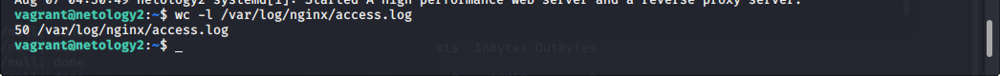

# devops-netology

1. Максимальный размер окна высчитывается по формуле:
   
   Полоса пропускания (бит/сек) * RTT = размер окна в битах, подставляя данные получаем:

  1000000000 * 0,3 / 8 = 37500000 байт

  Проверим на калькуляторе:

    Bandwidth-delay Product and buffer size
    BDP (1000 Mbit/sec, 300.0 ms) = 37.50 MByte
    required tcp buffer to reach 1000 Mbps with RTT of 300.0 ms >= 36621.1 KByte
    maximum throughput with a TCP window of 37500 KByte and RTT of 300.0 ms <= 1024.00 Mbit/sec.

2. Схема 

   

   Файлы конфигурации приложены (netology3_keepalived.conf, netology4_keepalived.conf)

   Проверяем:
      
         vagrant@netology5:~$ for i in {1..50}; do curl -I -s 172.28.128.200>/dev/null; done

   netology3

   

   netoligy1

   

   netology2

   

   Приостанавливаем netology3:

         (base) ghost@WS13:~/Work/vagrant$ vagrant suspend netology3
         ==> netology3: Saving VM state and suspending execution...
   
   Смотрим netology4:

   

   netology1

   

   netology2:

   
   

3. Заголовки в байтах: preamble - 7, frame delimiter - 1, Ethernet header - 14, Ethernet trailer - 4,
   
   IFG – 12, IP header – 20, TCP header – 20.

   Max TCP Payload = (MTU-TCP-IP)/(MTU+preamble+FD+Ethernet header+Ethernet trailer+IFG) = (1500-20-20)/(1500+7+1+14+4+12)=0,949

   Максимальная реальная скорость передачи составит 100*0,949=94,9 Mbit

   Размер фрейма повлияет прямопропорцианально, так как от его размера зависит размер полезных данных.

