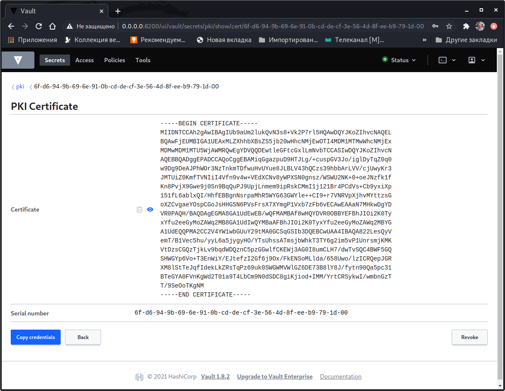

# devops-netology

1-2. Ставим Vault, проверяем корректность установки:

         vagrant@netology1:~/cert$ vault status
         Key             Value
         ---             -----
         Seal Type       shamir
         Initialized     true
         Sealed          false
         Total Shares    1
         Threshold       1
         Version         1.8.2
         Storage Type    inmem
         Cluster Name    vault-cluster-9e261d1c
         Cluster ID      ba0cb08f-e1b9-d729-36f9-7950a5d1cfe0
         HA Enabled      false

   

3. Создаем Root CA и Intermediate CA. 
   
         vagrant@netology1:~/cert$ vault secrets enable pki
         Success! Enabled the pki secrets engine at: pki/

         vagrant@netology1:~/cert$ vault write -field=certificate pki/root/generate/internal \
         > common_name="example.com" \
         > ttl=87600h > CA.crt

         vagrant@netology1:~/cert$ vault write pki/config/urls \
         > issuing_certificates="http://127.0.0.1/v1/pki/ca" \
         > crl_distribution_points="http://127.0.0.1/v1/pki/crl"
         Success! Data written to: pki/config/urls

   

         vagrant@netology1:~/cert$ vault secrets enable -path=pki_int pki
         Success! Enabled the pki secrets engine at: pki_int/

         vagrant@netology1:~/cert$ vault secrets tune -max-lease-ttl=43800h pki_int
         Success! Tuned the secrets engine at: pki_int/

         vagrant@netology1:~/cert$ vault write -format=json pki_int/intermediate/generate/internal \
         > common_name="example.com Intermediate Authority" \
         > | jq -r '.data.csr' > pki_intermediate.csr
       
         vagrant@netology1:~/cert$ vault write -format=json pki/root/sign-intermediate csr=@pki_intermediate.csr \
         > format=pem_bundle ttl="43800h" \
         > | jq -r '.data.certificate' > intermediate.cert.pem

         vagrant@netology1:~/cert$ vault write pki_int/intermediate/set-signed certificate=@intermediate.cert.pem
         Success! Data written to: pki_int/intermediate/set-signed

   

   Создаем роли:

         vagrant@netology1:~/cert$ vault write pki_int/roles/example-dot-com \
         > allowed_domains="example.com" \
         > allow_subdomains=true \
         > max_ttl="720h"
         Success! Data written to: pki_int/roles/example-dot-com

4.  Запрашиваем сертификат для домена netology.example.com:

         vagrant@netology1:~/cert$ vault write -format=json pki_int/issue/example-dot-com \
         > common_name="netology.example.com" \
         > ttl="72h" > netology.example.com.crt

   

   Создаем сертификат для netology.example.com:

         vagrant@netology1:~/cert$ cat netology.example.com.crt | jq -r .data.certificate > netology.example.com.pem
         vagrant@netology1:~/cert$ cat netology.example.com.crt | jq -r .data.issuing_ca >> netology.example.com.pem
         
   Создаем ключ для домена netology.example.com:

         vagrant@netology1:~/cert$ cat netology.example.com.crt \
         >| jq -r .data.private_key > netology.example.com.key

5. Настраиваем nginx, подкидываем сертификат и ключ:

         server {
                 listen 80 default_server;
                 listen [::]:80 default_server;
         
                 # SSL configuration
                 #
                  listen 443 ssl default_server;
                  listen [::]:443 ssl default_server;
         
                  ssl_certificate /home/vagrant/cert/netology.example.com.pem;
                  ssl_certificate_key /home/vagrant/cert/netology.example.com.key;
          
   Тестируем config:

         vagrant@netology1:~/cert$ sudo nginx -t
         nginx: the configuration file /etc/nginx/nginx.conf syntax is ok
         nginx: configuration file /etc/nginx/nginx.conf test is successful

   Перезапускаем nginx:

         vagrant@netology1:~/cert$ sudo systemctl reload nginx
         vagrant@netology1:~/cert$ sudo systemctl status nginx
         ● nginx.service - A high performance web server and a reverse proxy server
              Loaded: loaded (/lib/systemd/system/nginx.service; enabled; vendor preset: enabled)
              Active: active (running) since Tue 2021-09-28 04:52:31 UTC; 19min ago
                Docs: man:nginx(8)
             Process: 15597 ExecReload=/usr/sbin/nginx -g daemon on; master_process on; -s reload (code=exited, status=0/SUCCESS)
            Main PID: 15274 (nginx)
               Tasks: 2 (limit: 1074)
              Memory: 5.3M
              CGroup: /system.slice/nginx.service
                      ├─15274 nginx: master process /usr/sbin/nginx -g daemon on; master_process on;
                      └─15598 nginx: worker process
         
         Sep 28 04:52:31 netology1 systemd[1]: Starting A high performance web server and a reverse proxy server...
         Sep 28 04:52:31 netology1 systemd[1]: Started A high performance web server and a reverse proxy server.
         Sep 28 05:11:55 netology1 systemd[1]: Reloading A high performance web server and a reverse proxy server.
         Sep 28 05:11:56 netology1 systemd[1]: Reloaded A high performance web server and a reverse proxy server.

6. Модифицируем /etc/hosts:

         root@netology1:/home/vagrant/cert# echo 127.0.0.1 netology.example.com  >> /etc/hosts

   Добавляем сертификат Intermediate CA в доверенные:

         ln -s /home/vagrant/cert/intermediate.cert.pem \
         >/usr/local/share/ca-certificates/intermediate.cert.pem.crt

   Обновляем сертификаты:

         root@netology1:/home/vagrant/cert# update-ca-certificates
         Updating certificates in /etc/ssl/certs...
         1 added, 0 removed; done.
         Running hooks in /etc/ca-certificates/update.d...
         done.

   Отправляем тестовый запрос:

         root@netology1:/home/vagrant/cert# curl -I https://netology.example.com
         HTTP/1.1 200 OK
         Server: nginx/1.18.0 (Ubuntu)
         Date: Tue, 28 Sep 2021 05:34:42 GMT
         Content-Type: text/html
         Content-Length: 612
         Last-Modified: Tue, 28 Sep 2021 04:52:29 GMT
         Connection: keep-alive
         ETag: "61529f8d-264"
         Accept-Ranges: bytes

   Все ОК!

         

   

